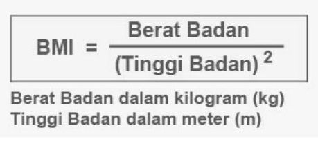

#Kalkulator BMI

**Kalkulator BMI (Body Mass Index)** adalah alat yang digunakan untuk menghitung indeks massa tubuh seseorang berdasarkan berat badan dan tinggi badan. BMI digunakan sebagai indikator sederhana untuk menentukan apakah seseorang memiliki berat badan yang sehat sesuai dengan tinggi badannya.

##Cara Kerja Kalkulator BMI
Kalkulator BMI menggunakan rumus berikut:

##Kategori BMI
Hasil BMI dikelompokkan dalam beberapa kategori, seperti:
1. Kurang berat badan (Underweight): BMI < 18,5
2. Normal (Ideal): BMI 18,5 - 24,9
3. Berat badan berlebih (Overweight): BMI 25 - 29,9
4. Obesitas: BMI ≥ 30
Kategori ini bisa sedikit berbeda berdasarkan jenis kelamin, usia, atau standar negara tertentu.

##Manfaat Kalkulator BMI
1. Mengidentifikasi Risiko Kesehatan: BMI yang terlalu rendah atau terlalu tinggi dapat mengindikasikan risiko kesehatan seperti kekurangan gizi, penyakit jantung, diabetes, atau obesitas.
2. Memantau Kesehatan: Membantu seseorang memahami kondisi tubuhnya dan mengambil langkah untuk meningkatkan gaya hidup sehat.
3. Alat Mudah dan Cepat: Tidak membutuhkan pengukuran yang rumit, hanya berat dan tinggi badan.

